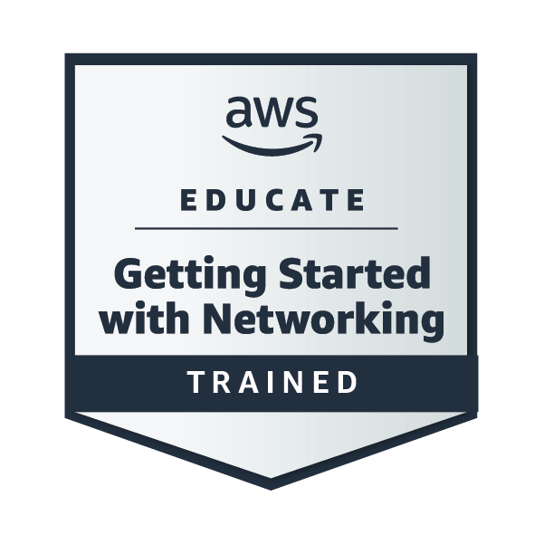

<!-- # 👋 Hi, I'm Hardik – DevOps Engineer -->

🔧 Highly curious and motivated toward DevOps and security — learning, growing, and building reliable, secure, and automated infrastructure.

## 🧰 Tech Stack:
- ☁️ **Cloud**: AWS, DigitalOcean
- 📦 **Containers**: Docker, Kubernetes
- 🔁 **CI/CD**: Jenkins
- 📜 **IaC & Automation**: Ansible, Terraform, Bash
- 📊 **Monitoring**: Prometheus, Grafana, NewRelic,  Alert-manager
- 🐧 **OS**: Linux, Ubuntu, RHEL, Rocky Linux, CentOS, Windows
- 💾 **Database**: MongoDB
- 🔒 **Security**: Hashicorp Vault

## 📜 Certificate:
- **HashiCorp Certified Vault Associate 002:** HashiCorp cloud engineer certifications
- **HashiCorp Certified:** Terraform Associate (Udemy) 
- **Nginx:** Beginner to Advanced (Udemy) 
- **AWS Certified Solution Architect:** Associate (Udemy) 

## My Badges

## 📫 Reach Me:
- LinkedIn: [hardikkangane](https://www.linkedin.com/in/hardikkangane/)
- Email: hardikkangane@gmail.com
